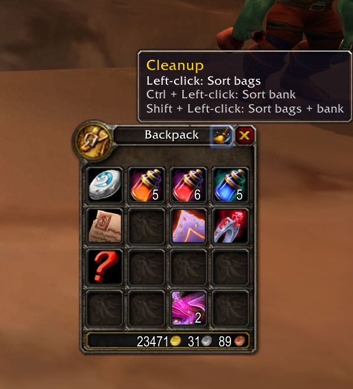

# CleanupBags аддон для World of Warcraft 3.3.5a

## Обзор

Этот аддон добавляет удобный значок в правом верхнем углу сумки; нажав на него, можно упорядочить содержимое сумок. Для работы требуется модуль **mod-autosort** (https://github.com/silviu20092/mod-autosort), так как аддон лишь вызывает команды, предоставляемые этим модулем.

## Как добавить аддон

1. Клонируйте этот репозиторий на свое устройство.
2. Скопируйте папку **CleanupBags** в папку **World of Warcraft\Interface\AddOns**.
3. Готово, убедитесь, что аддон включен в игре.

## Автор
- silviu20092