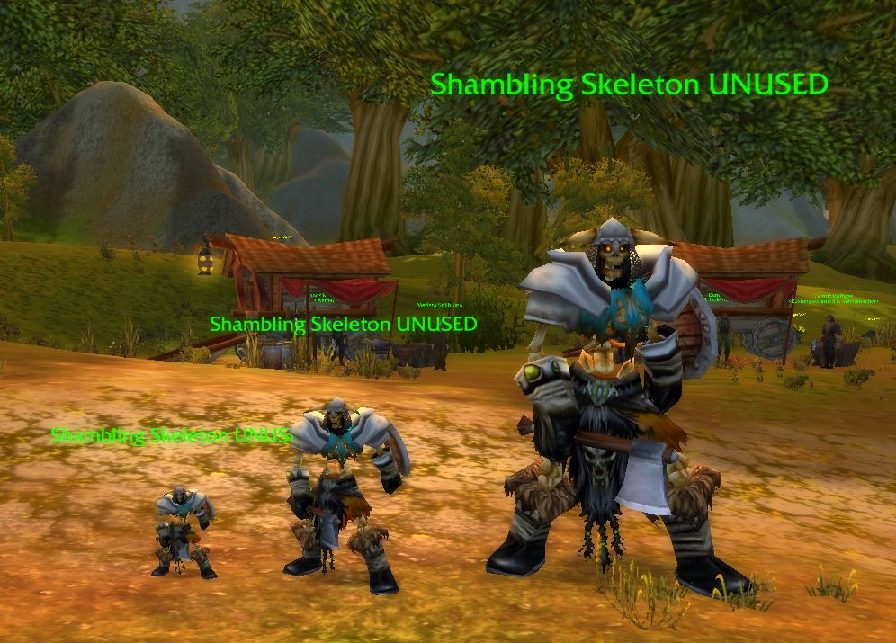
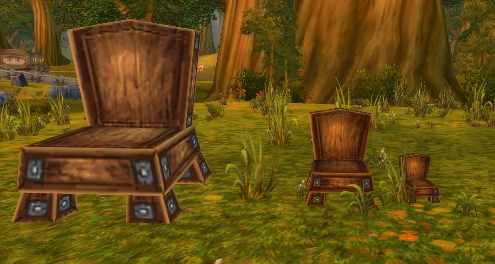

# Short Overview (for AzerothCore-Catalouge)

* Name:   Objscale
* What it does: This module allows to set the scale/size of GameObjects and Creatures for each individual spawn.
* Author:   Tralenor
* Repository:   https://github.com/Tralenor/mod-objscale
* Download:   https://github.com/Tralenor/mod-objscale/archive/refs/heads/main.zip
* License:   MIT

# Objscale

## Description

This module allows to set the scale/size of GameObjects and Creatures for each individual spawn. (This is a port of the [Objscale TC-Corepatch from Rochet2](https://github.com/Rochet2/TrinityCore/tree/objscale_3.3.5/src/server/scripts/Custom/objscale))
This is done by setting the spawns scale to a custom value, which is independend from the template and saved in two new databasetables: objscale_creature and objscale_gameobject.






## How to use ingame

#### Creatures# Objscale

## Описание

Этот модуль позволяет задавать масштаб (размер) игровых объектов (GameObject) и существ (Creature) для каждого конкретного случая появления (спавна). (Это порт патча [Objscale TC-Corepatch от Rochet2](https://github.com/Rochet2/TrinityCore/tree/objscale_3.3.5/src/server/scripts/Custom/objscale)).
Это реализуется путем установки для спавна пользовательского значения масштаба, которое не зависит от шаблона и сохраняется в двух новых таблицах базы данных: objscale_creature и objscale_gameobject.


## Как использовать в игре

#### Существа

Выберите существо (укажите его в качестве цели), а затем используйте следующую команду: 

```
npc_scale set X
```

replace X with any positive floatingpoint number

#### Игровые объекты

* Узнайте GUID нужного игрового объекта (например, подойдите к объекту и используйте команду `.gobject near`).

* Используйте следующую команду, чтобы задать масштаб игрового объекта:

  ```
  gob_scale set Y X
  ```

  * Где Y — это GUID игрового объекта (GameObject), который нужно изменить (команда также принимает гиперссылки на игровые объекты, генерируемые командой `.gobject near`). 
  * А X — это коэффициент масштабирования (используйте любое положительное число с плавающей запятой).

  


## Требования

Для работы модуля objscale требуется:

- AzerothCore с коммитом не ранее `6cf82e3bd6cd481405be04ae67afa30d280a91bf` (добавлен в основной репозиторий 6 мая 2022 г.)
- ИЛИ: добавление двух необходимых хуков (`OnCreatureSaveToDB` и `OnGameObjectSaveToDB`) путем слияния (merge) изменений из репозитория https://github.com/Tralenor/azerothcore-wotlk/tree/On-Creature/GameObject-SaveToDB-Hook в ваш проект.

## Установка

```
1) Просто выполните `git clone` модуля в директорию `modules` исходного кода AzerothCore или скопируйте его вручную.
2) Вручную импортируйте SQL-файл в базу данных World.
3) Повторно запустите cmake и выполните чистую сборку AzerothCore.
```


## Авторы

* [Tralenor](https://github.com/Tralenor) (автор модуля)
* [Rochet2](https://github.com/Rochet2) (Первоначальный автор Objscale)
* AzerothCore: [репозиторий](https://github.com/azerothcore) - [сайт](http://azerothcore.org/) - [сообщество в чате discord](https://discord.gg/PaqQRkd)


Select/target a Creature and then use the following Command: 

```
npc_scale set X
```

replace X with any positive floatingpoint number

#### GameObjects

* Get the GUID of the wanted Gameobject (e.g walk up to the GameObject and use the Command .gobject near)

* use the following command to set the GameObjects scale: 

  ```
  gob_scale set Y X
  ```

  * Where Y is the GUID of the GameObject which is to be Changed. (the command also accepts the GameObject-Hyperlinks which are generated by the .gobject near command)
  * And X is the scaling factor (use any positive floatingpoint number)

  


## Requirements

the objscale Module requires:

- AzerothCore with at least commit : 6cf82e3bd6cd481405be04ae67afa30d280a91bf (added to main Repo on 6 May 2022)
- OR: add the two needed hooks (OnCreatureSaveToDB and OnGameObjectSaveToDB) by merging https://github.com/Tralenor/azerothcore-wotlk/tree/On-Creature/GameObject-SaveToDB-Hook into your project

## Installation

```
1) Simply `git clone` the module under the `modules` directory of your AzerothCore source or copy paste it manually.
2) Import the SQL manually to the World Database
3) Re-run cmake and launch a clean build of AzerothCore.
```


## Credits

* [Tralenor](https://github.com/Tralenor) (author of the module)
* [Rochet2](https://github.com/Rochet2) (Original Author of Objscale)
* AzerothCore: [repository](https://github.com/azerothcore) - [website](http://azerothcore.org/) - [discord chat community](https://discord.gg/PaqQRkd)
