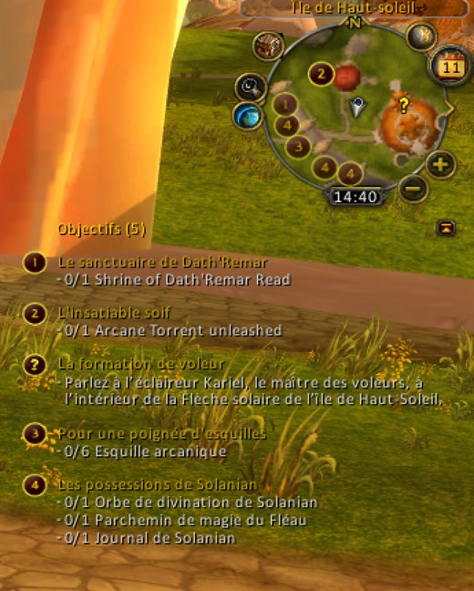
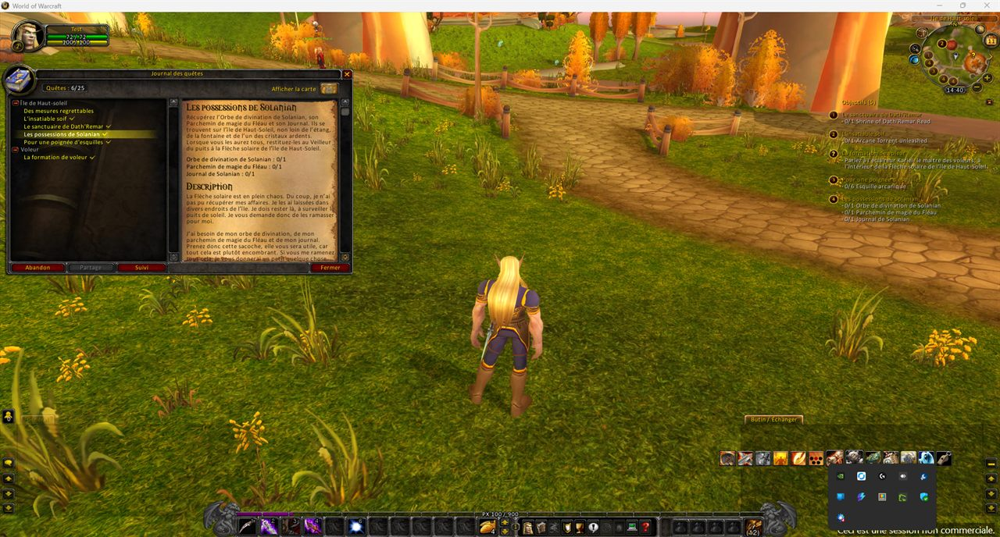

# mod-quest-radar

Модуль на C++ для **AzerothCore 3.3.5a**, показывающий местоположение целей текущих заданий в духе QuestHelper или Questie, а также клиентский аддон ([`client-addon/QuestRadar/`](client-addon/QuestRadar)), отображающий их в виде значков на **мини-карте** (чего не было в оригинальной версии WotLK).

## Скриншоты

| По одному значку на цель с подписью задания | Вид в игре |
|---|---|
|  |  |

У задания № 4 в трекере — «Личные вещи Соланиана» — три цели в трех разных местах, поэтому на мини-карте отображаются три значка, помеченных цифрой «4».


Один и тот же момент, те же задания: на карте мира (слева) отображается **один** значок для задания №4, тогда как на мини-карте (справа) показаны три отдельные цели этого задания. Клиентский API, используемый картой мира (`QuestPOIGetIconInfo`), возвращает лишь одну позицию для каждого задания, в то время как модуль считывает данные из таблиц `quest_poi` без этого ограничения.

## Две составляющие

1. **Серверный модуль** (`src/`) считывает данные из таблиц `quest_poi` / `quest_poi_points` и передает информацию о целях, известных игроку, в чат (команда `.questradar`) или через механизм обмена данными аддонов (`CHAT_MSG_ADDON`).
2. **Клиентский аддон** (`client-addon/QuestRadar/`) отображает эти цели на мини-карте. Серверный модуль не имеет доступа к элементам интерфейса клиента, поэтому отрисовка выполняется на стороне аддона.

Поставляемый в комплекте аддон **работает и без модуля**: он использует данные о точках интереса (POI) заданий, которые уже есть в клиенте. При обнаружении модуля аддон переключается в расширенный режим, отображая по одному значку для каждой *цели* задания, а не один значок на всё задание. Подробности см. в файле [`client-addon/README.md`](client-addon/README.md).

## Особенности

- Сообщает в чат о ближайших известных целях при принятии задания
(`QuestRadar.AnnounceOnAccept`).
- Команда `.questradar` (псевдоним `.qr`): выводит список ближайших целей для всех
активных заданий на текущей карте.
- Механизм синхронизации с аддонами (`QuestRadar.AddonSyncEnabled`): передает
позицию игрока и полный список целей на карте для их отображения на миникарте.
- Использует только те данные, которые уже загружаются ядром
(`ObjectMgr::GetQuestPOIVector`): не требует создания новых таблиц или импорта SQL.
- Не зависит от Eluna или каких-либо других модулей.

## Установка

### 1. Скопируйте модуль

```bash
cp -r mod-quest-radar/ <azerothcore>/modules/
```

Сохраните папку с именем **`mod-quest-radar`** — AzerothCore использует его для определения имени точки входа `Addmod_quest_radarScripts()` (см. `src/QuestRadarLoader.cpp`).

### 2. Сборка

```bash
cd <azerothcore>/build
cmake .. -DMODULES_FOLDER=../modules
make -j$(nproc)
```

### 3. Настройка

```bash
cp conf/mod-questradar.conf.dist <worldserver_dir>/mod-questradar.conf
```

### 4. Запустите worldserver

Модуль загружается автоматически:
```
mod-questradar: Loaded - Enabled=1 AnnounceOnAccept=1 MaxObjectivesShown=3 AddonSyncEnabled=1
```

### 5. Установите клиентский аддон (необязательно, для значков на мини-карте)

```bash
cp -r mod-quest-radar/client-addon/QuestRadar/ <client_wow>/Interface/AddOns/
```

В комплект поставки входит всё необходимое, включая библиотеку Astrolabe. Информацию о настройках и командах (начинающихся с `/qr`) можно найти в [файле README аддона](client-addon/QuestRadar/README.md).

## Настройка

| Параметр | Значение по умолчанию | Действие |
|---|---|---|
| `QuestRadar.Enable` | `1` | Главный переключатель (вкл./выкл.) |
| `QuestRadar.AnnounceOnAccept` | `1` | Объявлять цели при принятии задания |
| `QuestRadar.MaxObjectivesShown` | `3` | Макс. количество целей в одном сообщении чата |
| `QuestRadar.AddonSyncEnabled` | `1` | Использование моста «сервер–аддон» для значков на мини-карте |

## Структура файлов

```
mod-quest-radar/
├── conf/
│   └── mod-questradar.conf.dist
├── src/
│   ├── QuestRadar.h           # config + structures + prototypes
│   ├── QuestRadar.cpp         # objective lookup + addon protocol formatting
│   └── QuestRadarLoader.cpp   # hooks, .questradar command, addon bridge
└── client-addon/              # see client-addon/README.md
    ├── QuestRadar/            # shipped addon (standalone, uses the module when present)
    └── server-module-variant/ # reference: the original bridge-only addon
```

## Используемые крючки

| Крюк | Когда | Действие |
|---|---|---|
| `OnBeforeConfigLoad` | Запуск /`.reload config` | Загружает конфигурацию `.conf` |
| `OnPlayerQuestAccept` | Игрок принимает квест | Объявляет ближайшие цели |
| `OnPlayerBeforeSendChatMessage` | Аддон отправляет запрос `REQ` | Ответы с известными целями |
| `.questradar` / `.qr` | По просьбе игрока | Объявляет ближайшие цели |
